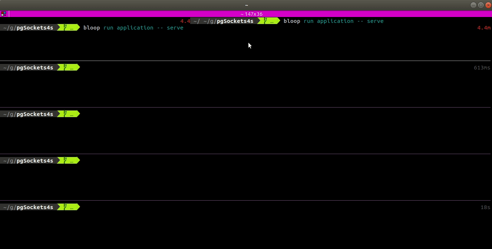

# pgsockets4s

An API project that uses `skunk` and `http4s` to serve Postgres notifications over websockets.

This project was bootstrapped with [`azavea.g8`](https://github.com/azavea/azavea.g8), a
[giter8 template](https://github.com/foundweekends/giter8) for creating applications on the
Typelevel stack.

### Development

The following tools must be present for a development environment:

- Docker
- Java 8 or newer -- if this is a problem, try using [`jabba`](https://github.com/shyiko/jabba#jabba--) to manage different java versions
- Sbt 1.x -- the newer the better probably, installation instructions can be found [here](https://www.scala-sbt.org/download.html)
- [Bloop](https://scalacenter.github.io/bloop/) -- this is a scala build server that should run in the background for building the project; installation instructions can be found [here](https://scalacenter.github.io/bloop/setup)
- [rambler](https://github.com/elwinar/rambler) -- a cross-platform migration runner

### Setting up the project for the first time

_tl;dr_:

- make sure you have `rambler`, `docker-compose`, and `bloop` installed
- `./scripts/easy-start` -- this will set up the database with the world database from the [`doobie`](https://tpolecat.github.io/doobie/docs/01-Introduction.html#sample-database-setup) docs, apply migrations to add notifications for new cities, and start the application
- (in another terminal) `websocat ws://localhost:8080/api/ws/prt`
- (in still _another_ terminal), `curl -X POST localhost:8080/api/city` a few times, until you get lucky and your new city is in Portugal (it has an equal chance of being in Portugal, Kenya, or China)

### STRTA

This project uses [`scripts-to-rule-them-all`](https://github.blog/2015-06-30-scripts-to-rule-them-all/) for managing the developer experience. Below is a quick explanation for the specific usage of each for this particular project.

| Script    | Use                                                                                                                     |
| --------- | ----------------------------------------------------------------------------------------------------------------------- |
| `update`  | Update project, assemble, run migrations; assume that you can test any PR after running this script on that PR's branch |
| `console` | Open an `ammonite` shell                                                                                                |
| `server`  | Start the server                                                                                                        |
| `dbshell` | Open a `psql` shell connected to the database                                                                           |
| `migrate` | Run migrations against the database                                                                                     |
| `tests`   | Run tests                                                                                                               |
